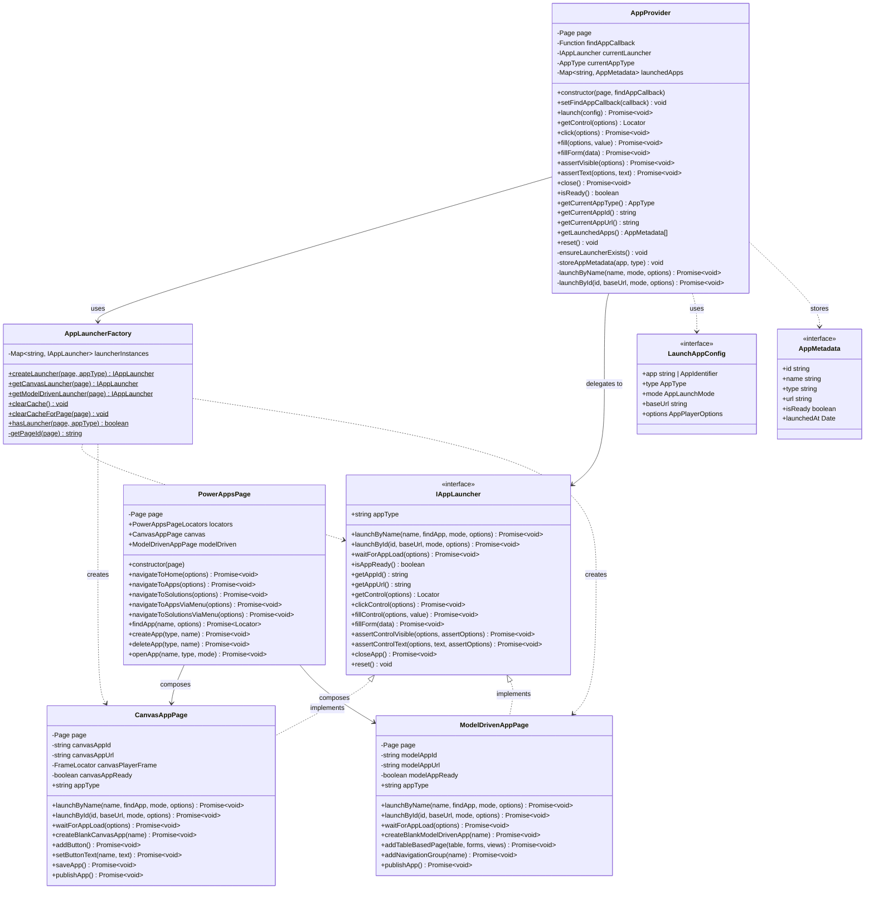
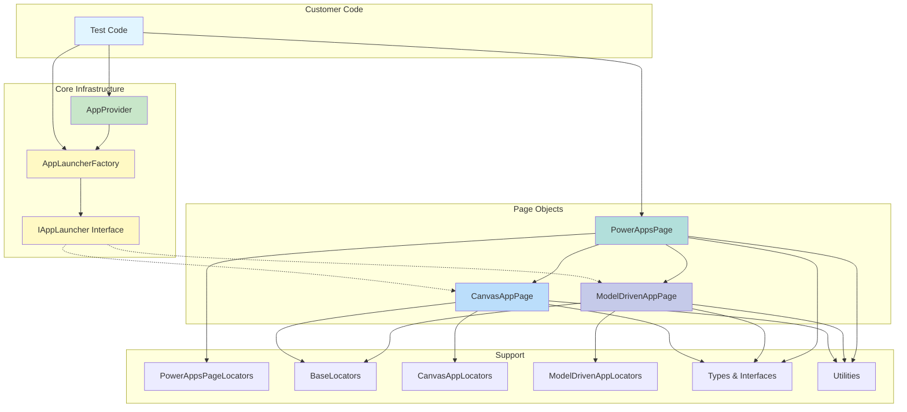

# Core Components

This page details the class structure and component relationships in the toolkit.

> **Note:** For a high-level overview, see the [Architecture Overview](/architecture/overview).

## Class Diagram

### Core Infrastructure

## Component Relationships

### Dependency Graph

## Component Summary

| Component              | Purpose                     | Key Methods                                  |
| ---------------------- | --------------------------- | -------------------------------------------- |
| **AppProvider**        | Simplest API for customers  | launch(), click(), fill(), assertVisible()   |
| **AppLauncherFactory** | Create and manage launchers | createLauncher(), clearCache()               |
| **PowerAppsPage**      | Unified entry point         | navigateToApps(), findApp(), createApp()     |
| **CanvasAppPage**      | Canvas-specific operations  | launchById(), createBlankCanvasApp()         |
| **ModelDrivenAppPage** | Model Driven operations     | launchById(), createBlankModelDrivenApp()    |
| **IAppLauncher**       | Contract for all launchers  | All core testing operations                  |

## Next Steps

- [Usage Patterns](/architecture/patterns) - Learn when to use each component
- [Sequence Diagrams](/architecture/sequences) - See how components interact
- [Extending the Toolkit](/architecture/extending) - Add new app types
- [API Reference](/reference) - Complete API documentation
