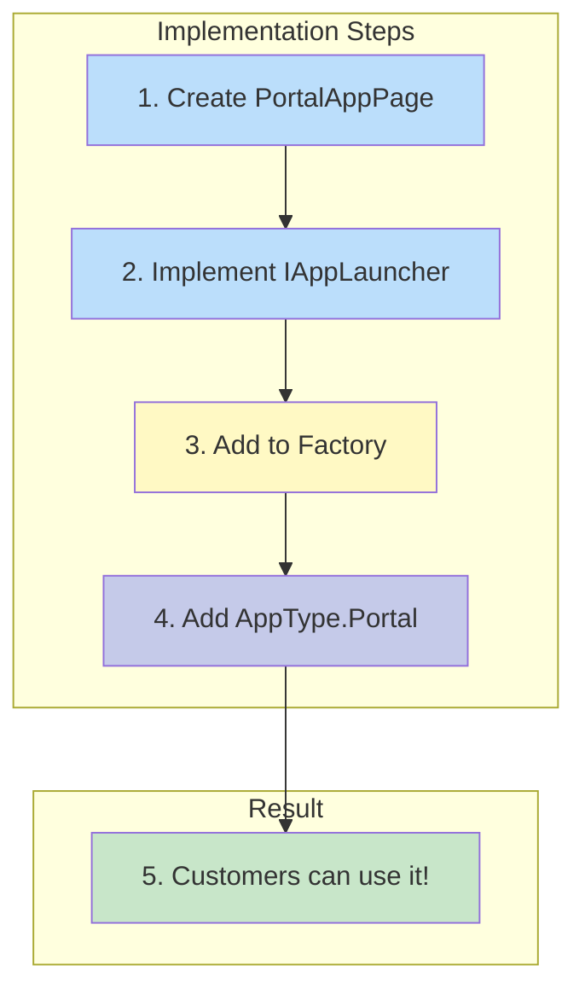
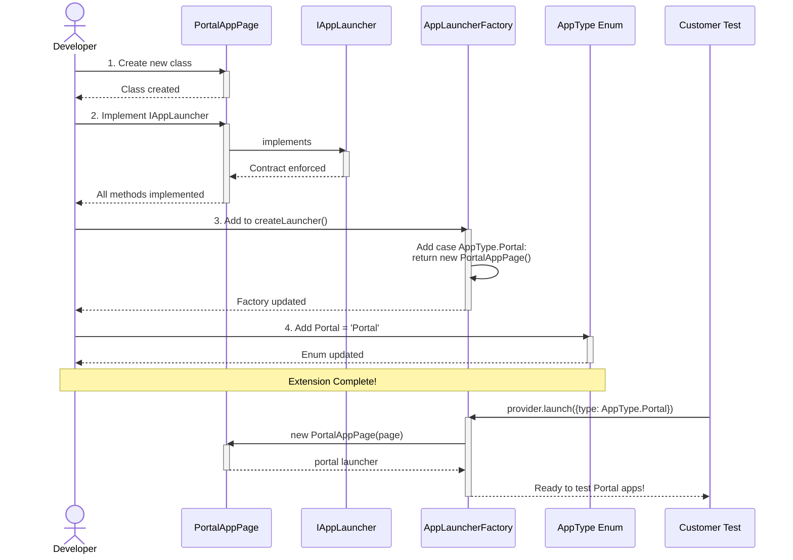
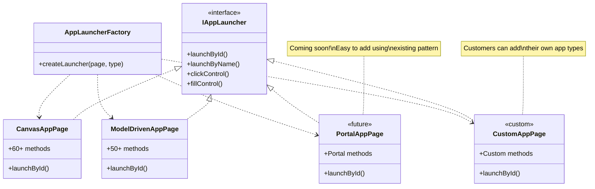

# Extending the Toolkit

Learn how to extend the toolkit by adding support for new app types.

> **Note:** The toolkit is designed for extensibility. Adding a new app type typically requires implementing one class and updating the factory.

## Adding a New App Type

### Overview



### Step-by-Step Process



## Implementation Guide

### Step 1: Create the Page Class

Create a new file `lib/pages/PortalAppPage.ts`:

```typescript
import { Page, Locator, FrameLocator } from '@playwright/test';
import { IAppLauncher } from '../types/IAppLauncher';
import { AppLaunchMode } from '../types/AppLaunchMode';

export class PortalAppPage implements IAppLauncher {
  readonly appType = 'Portal';

  private page: Page;
  private portalAppId: string | null = null;
  private portalAppUrl: string | null = null;
  private portalAppReady: boolean = false;

  constructor(page: Page) {
    this.page = page;
  }

  // Required by IAppLauncher
  async launchById(id: string, baseUrl: string, mode: AppLaunchMode, options?: any): Promise<void> {
    this.portalAppId = id;
    this.portalAppUrl = `${baseUrl}/portals/${id}`;

    await this.page.goto(this.portalAppUrl);
    await this.waitForAppLoad(options);
  }

  async launchByName(
    name: string,
    findApp: any,
    mode: AppLaunchMode,
    options?: any
  ): Promise<void> {
    const appLocator = await findApp(name);
    await appLocator.click();

    // Wait for portal to load
    await this.waitForAppLoad(options);
  }

  async waitForAppLoad(options?: any): Promise<void> {
    // Portal-specific loading logic
    await this.page.waitForLoadState('networkidle');
    this.portalAppReady = true;
  }

  // State methods
  isAppReady(): boolean {
    return this.portalAppReady;
  }

  getAppId(): string | null {
    return this.portalAppId;
  }

  getAppUrl(): string | null {
    return this.portalAppUrl;
  }

  // Control interaction methods
  getControl(options: any): Locator {
    // Portal-specific control locator logic
    return this.page.locator(`[data-id="${options.name}"]`);
  }

  async clickControl(options: any): Promise<void> {
    const control = this.getControl(options);
    await control.click();
  }

  async fillControl(options: any, value: string): Promise<void> {
    const control = this.getControl(options);
    await control.fill(value);
  }

  async fillForm(data: Record<string, string>): Promise<void> {
    for (const [name, value] of Object.entries(data)) {
      await this.fillControl({ name }, value);
    }
  }

  // Assertion methods
  async assertControlVisible(options: any, assertOptions?: any): Promise<void> {
    const control = this.getControl(options);
    await control.waitFor({ state: 'visible', ...assertOptions });
  }

  async assertControlText(options: any, text: string, assertOptions?: any): Promise<void> {
    const control = this.getControl(options);
    await control.waitFor({ state: 'visible', ...assertOptions });
    const actualText = await control.textContent();
    if (actualText !== text) {
      throw new Error(`Expected "${text}" but got "${actualText}"`);
    }
  }

  // Lifecycle methods
  async closeApp(): Promise<void> {
    this.portalAppReady = false;
  }

  reset(): void {
    this.portalAppId = null;
    this.portalAppUrl = null;
    this.portalAppReady = false;
  }

  // Portal-specific methods
  async navigateToPage(pageName: string): Promise<void> {
    // Portal-specific navigation
    await this.page.click(`a[href*="${pageName}"]`);
  }

  async submitWebForm(formName: string): Promise<void> {
    // Portal-specific form submission
    await this.page.click(`button[data-form="${formName}"]`);
  }
}
```

### Step 2: Update the Factory

Add Portal support to `lib/core/app-launcher.factory.ts`:

```typescript
import { PortalAppPage } from '../pages/PortalAppPage';

export class AppLauncherFactory {
  static createLauncher(page: Page, appType: AppType): IAppLauncher {
    // Check cache first...

    let launcher: IAppLauncher;
    switch (appType) {
      case AppType.Canvas:
        launcher = new CanvasAppPage(page);
        break;
      case AppType.ModelDriven:
        launcher = new ModelDrivenAppPage(page);
        break;
      case AppType.Portal: // Add this case
        launcher = new PortalAppPage(page);
        break;
      default:
        throw new Error(`Unknown app type: ${appType}`);
    }

    // Store in cache...
    return launcher;
  }

  static getPortalLauncher(page: Page): IAppLauncher {
    return this.createLauncher(page, AppType.Portal);
  }
}
```

### Step 3: Update AppType Enum

Add Portal to `lib/types/AppType.ts`:

```typescript
export enum AppType {
  Canvas = 'Canvas',
  ModelDriven = 'ModelDriven',
  Portal = 'Portal', // Add this
}
```

### Step 4: Export from Index

Update `lib/index.ts`:

```typescript
export { PortalAppPage } from './pages/PortalAppPage';
```

### Step 5: Customers Can Use It!

Now customers can immediately start testing Portal apps:

```typescript
import { test } from '@playwright/test';
import { AppProvider, AppType } from 'playwright-power-platform-toolkit';

test('Test Portal app', async ({ page }) => {
  const provider = new AppProvider(page);

  // Launch Portal app
  await provider.launch({
    app: { id: 'portal-id' },
    type: AppType.Portal,
  });

  // Use standard provider methods
  await provider.click({ name: 'Submit' });
  await provider.assertVisible({ name: 'Success' });
});
```

## Factory Extensibility Pattern



## Key Design Principles

### 1. Interface Contract

> **Important:** All app types must implement the `IAppLauncher` interface.

This ensures consistency across all app types and allows the factory pattern to work correctly.

### 2. Separation of Concerns

Each page class is responsible for:

- App-specific launch logic
- App-specific control interactions
- App-specific locator strategies

### 3. Composition Over Inheritance

The `PowerAppsPage` demonstrates composition by including `CanvasAppPage` and `ModelDrivenAppPage` instances rather than inheriting from them.

### 4. Factory Caching

The factory caches launcher instances for performance. New app types automatically benefit from this caching.

## Testing Your Extension

Create tests to verify your new app type works correctly:

```typescript
import { test, expect } from '@playwright/test';
import { AppProvider, AppType, AppLauncherFactory } from '../lib';
import { PortalAppPage } from '../lib/pages/PortalAppPage';

test.describe('Portal App Extension', () => {
  test('Factory creates Portal launcher', async ({ page }) => {
    const launcher = AppLauncherFactory.createLauncher(page, AppType.Portal);
    expect(launcher).toBeInstanceOf(PortalAppPage);
    expect(launcher.appType).toBe('Portal');
  });

  test('AppProvider can launch Portal app', async ({ page }) => {
    const provider = new AppProvider(page);

    await provider.launch({
      app: { id: 'test-portal-id' },
      type: AppType.Portal,
    });

    expect(provider.isReady()).toBe(true);
    expect(provider.getCurrentAppType()).toBe(AppType.Portal);
  });

  test('Portal app control interactions', async ({ page }) => {
    const portal = new PortalAppPage(page);

    await portal.launchById('test-id', 'https://portals.example.com', 'Play');
    await portal.clickControl({ name: 'TestButton' });
    await portal.assertControlVisible({ name: 'TestButton' });
  });
});
```

## Contributing Extensions

If you've created a valuable extension, consider contributing it back to the project:

1. **Create the implementation** following the pattern above
2. **Add comprehensive tests** for the new app type
3. **Update documentation** with usage examples
4. **Submit a pull request** to the repository

## Next Steps

- [Core Components](/architecture/components) - Understand the class structure
- [Usage Patterns](/architecture/patterns) - Learn when to use each pattern
- [API Reference](/reference) - Complete API documentation
- [Contributing Guide](https://github.com/deepakkamboj/playwright-power-platform-toolkit/blob/main/CONTRIBUTING.md) - How to contribute
