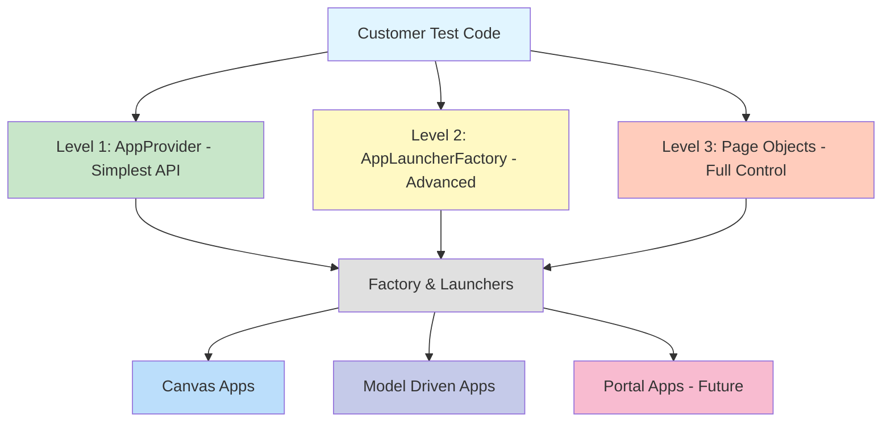
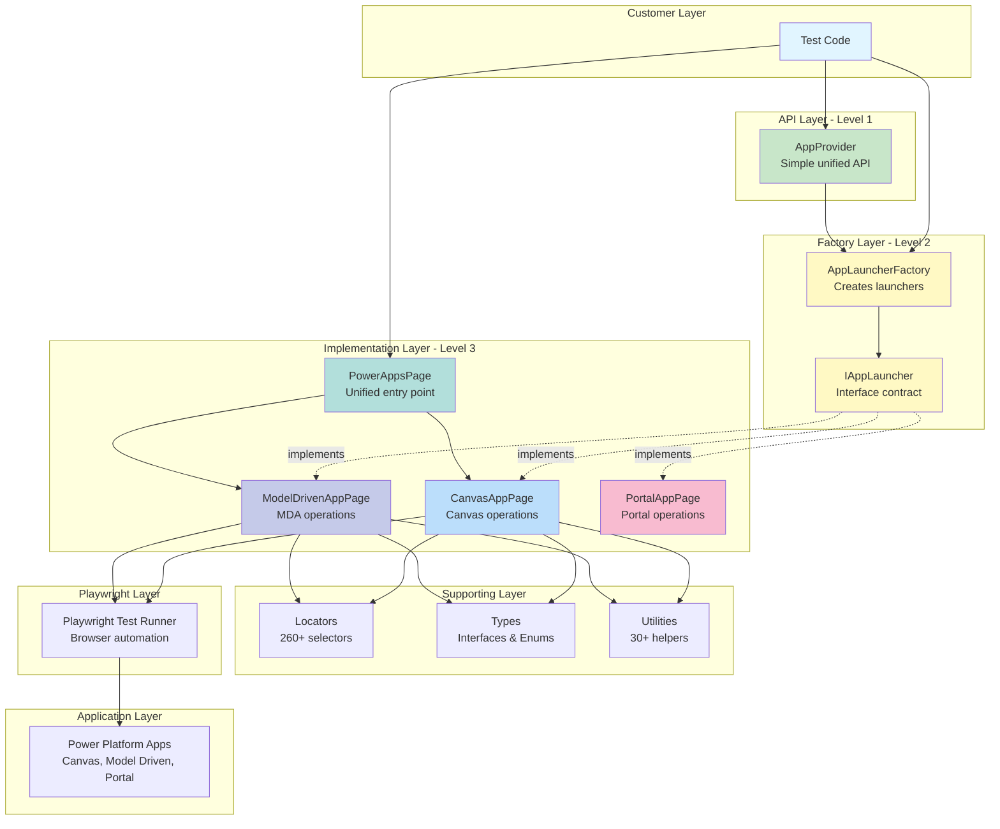

# Architecture Overview

import { Cards, Card } from '../../components/Cards';
import { Package, Target, GitBranch, Wrench } from 'lucide-react';

The Playwright Power Platform Toolkit uses a layered architecture with factory and provider patterns to simplify testing Power Platform applications.

> **Quick Start:** New to the toolkit? Check out the [Getting Started Guide](/guide/getting-started) first.

## Architecture Layers

The toolkit provides three levels of abstraction for different use cases:



### Level 1: AppProvider (Recommended)

> **Best for:** Testing existing apps

The simplest API for launching and testing Power Platform apps.

```typescript
const provider = new AppProvider(page);
await provider.launch({ app: { id: 'app-id' }, type: AppType.Canvas });
await provider.click({ name: 'Submit' });
```

**[Learn more about AppProvider →](/architecture/patterns#pattern-1-appprovider-for-testing-recommended)**

### Level 2: AppLauncherFactory (Advanced)

> **Best for:** Custom launcher logic and advanced scenarios

Direct access to app launchers with caching and factory management.

```typescript
const launcher = AppLauncherFactory.getCanvasLauncher(page);
await launcher.launchById('app-id', baseUrl, AppLaunchMode.Play);
```

**[Learn more about Factory Pattern →](/architecture/patterns#pattern-2-factory-for-advanced-scenarios)**

### Level 3: Page Objects (Full Control)

> **Best for:** Creating new apps and studio operations

Direct access to page objects for maximum control and app creation capabilities.

```typescript
const powerApps = new PowerAppsPage(page);
await powerApps.canvas.createBlankCanvasApp('TestApp');
```

**[Learn more about Page Objects →](/architecture/patterns#pattern-3-powerappspage-for-app-creation)**

## System Architecture



## Core Components

| Component              | Purpose                     | Learn More                                  |
| ---------------------- | --------------------------- | ------------------------------------------- |
| **AppProvider**        | Simplest API for customers  | [Usage Patterns](/architecture/patterns)    |
| **AppLauncherFactory** | Create and manage launchers | [Usage Patterns](/architecture/patterns)    |
| **PowerAppsPage**      | Unified entry point         | [Usage Patterns](/architecture/patterns)    |
| **CanvasAppPage**      | Canvas-specific operations  | [Core Components](/architecture/components) |
| **ModelDrivenAppPage** | Model Driven operations     | [Core Components](/architecture/components) |
| **IAppLauncher**       | Contract for all launchers  | [Core Components](/architecture/components) |

## Key Design Principles

### 1. Separation of Concerns

Each layer has a specific responsibility, making the toolkit easy to understand and maintain.

### 2. Extensibility

> **Tip:** Adding a new app type is easy! Just implement the `IAppLauncher` interface.

The factory pattern makes it simple to add support for new app types. See the [Extension Guide](/architecture/extending) for details.

### 3. Flexibility

Three levels of abstraction let you choose the right tool for the job:

- Simple tests? Use AppProvider
- Advanced scenarios? Use the Factory
- Maximum control? Use Page Objects directly

### 4. Type Safety

Full TypeScript support with interfaces and enums ensures compile-time safety and excellent IDE support.

### 5. Performance

Factory caching ensures launcher instances are reused for better performance.

## Quick Decision Guide

Not sure which pattern to use? Here's a quick guide:

```
Testing existing app by ID? → AppProvider ✅
Testing existing app by name? → AppProvider with PowerAppsPage ✅
Creating new app? → PowerAppsPage ✅
Need custom logic? → AppLauncherFactory ✅
Need maximum control? → Page Objects directly ✅
Adding new app type? → Implement IAppLauncher ✅
```

**[See detailed decision tree →](/architecture/patterns#decision-tree)**

## Explore the Architecture

<Cards cols={2}>
  <Card icon={<Package />} title="Core Components" href="/architecture/components">
    Understand the classes, interfaces, and their relationships
  </Card>
  <Card icon={<Target />} title="Usage Patterns" href="/architecture/patterns">
    Learn when and how to use each pattern with examples and decision trees
  </Card>
  <Card icon={<GitBranch />} title="Sequence Diagrams" href="/architecture/sequences">
    See detailed interaction flows between components
  </Card>
  <Card icon={<Wrench />} title="Extending" href="/architecture/extending">
    Add support for new app types with the extension guide
  </Card>
</Cards>

## Additional Resources

- **[Quick Reference](/architecture/quick-reference)** - Quick reference card for common tasks
- **[Architecture Diagram](/architecture/diagram)** - Detailed system architecture diagram
- **[Getting Started Guide](/guide/getting-started)** - Complete usage guide
- **[Example Tests](https://github.com/deepakkamboj/playwright-power-platform-toolkit/tree/main/packages/e2e-tests/tests)** - Runnable example tests
- **[API Reference](/reference)** - Complete API documentation

---

**Architecture Status**: ✅ Production Ready

Last Updated: January 2026
