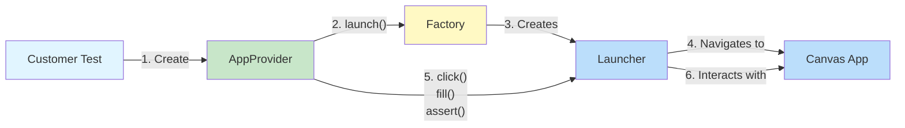
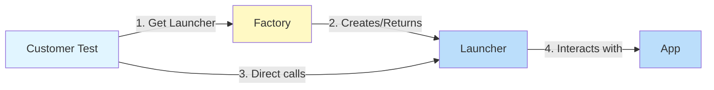
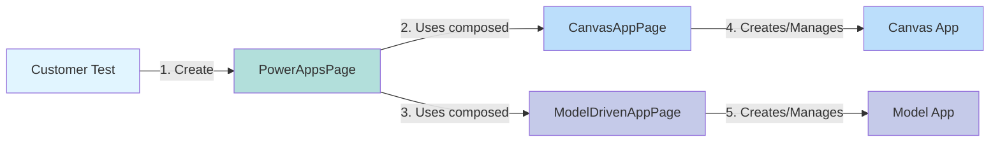
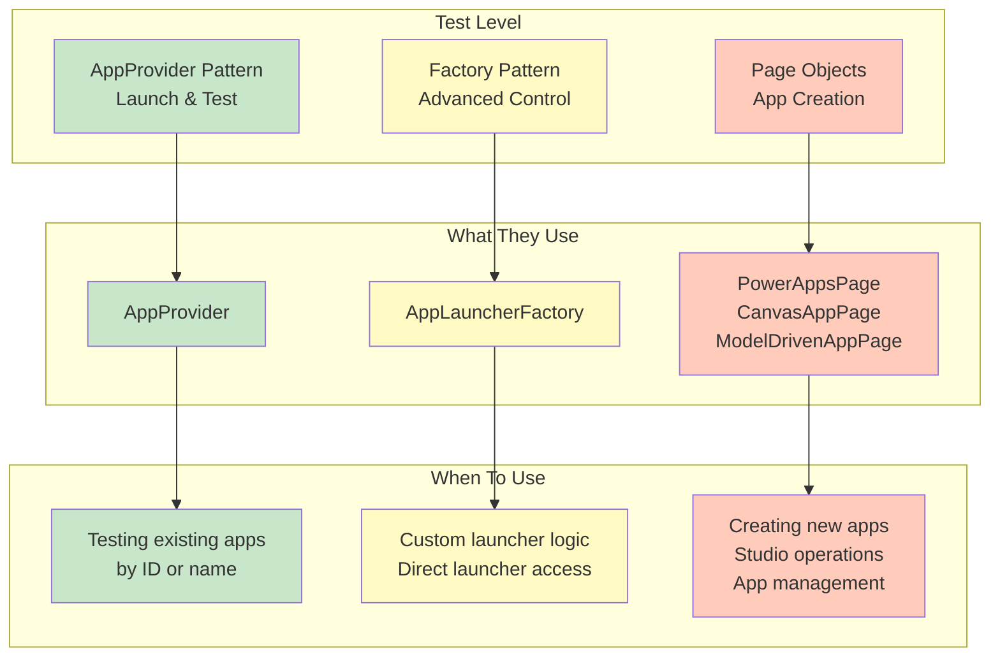
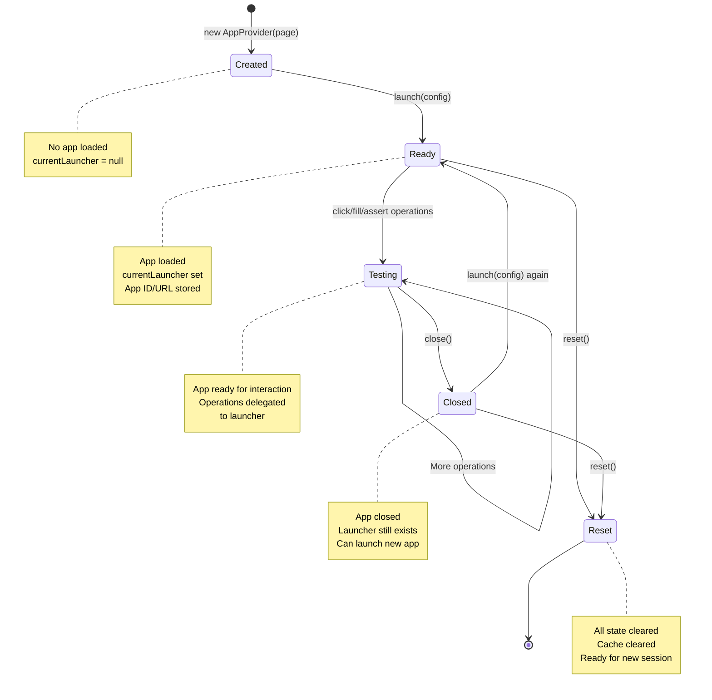
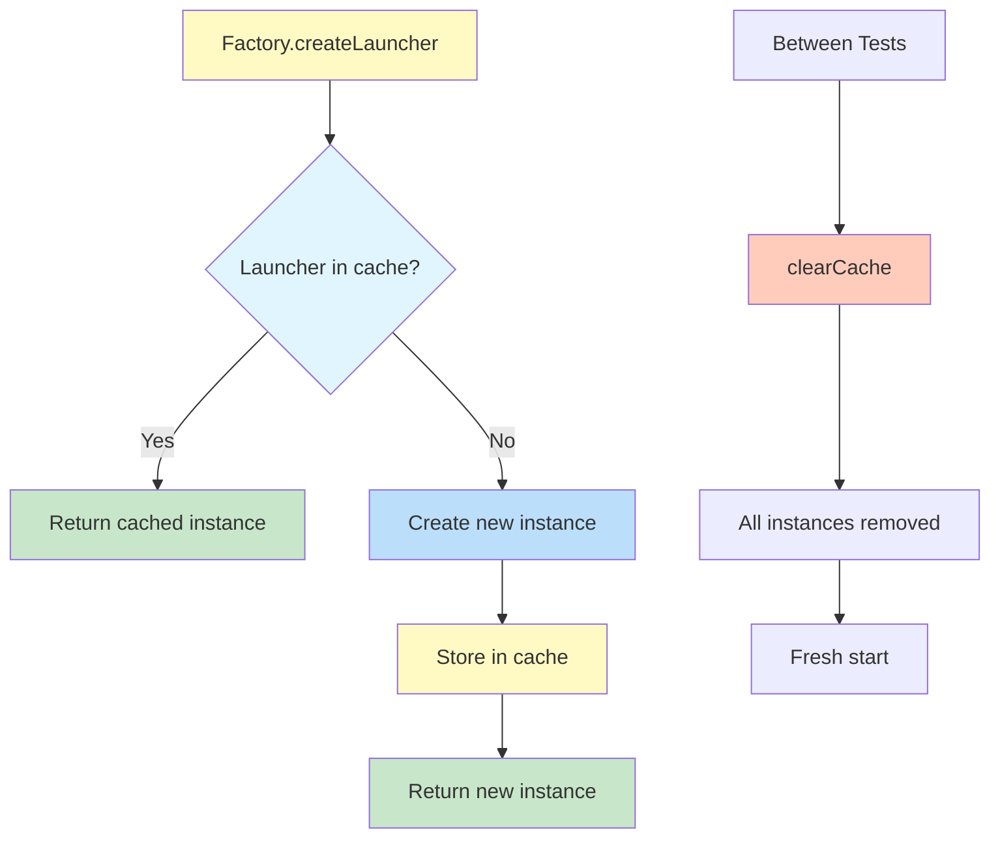

# Usage Patterns

This page explains when and how to use each pattern in the toolkit.

> **Tip:** Not sure which pattern to use? Check the [Decision Tree](#decision-tree) at the bottom of this page.

## Pattern 1: AppProvider for Testing (Recommended)

**Best for:** Testing existing apps by ID or name



### Code Example

```typescript
import { AppProvider, AppType, AppLaunchMode } from 'playwright-power-platform-toolkit';

test('Test with AppProvider', async ({ page }) => {
  const provider = new AppProvider(page);

  // Launch app by ID (fastest)
  await provider.launch({
    app: { id: 'app-id' },
    type: AppType.Canvas,
    mode: AppLaunchMode.Play
  });

  // Interact with controls
  await provider.click({ name: 'Submit' });
  await provider.fill({ name: 'Email' }, 'test@example.com');

  // Assert results
  await provider.assertVisible({ name: 'Success' });
  await provider.assertText({ name: 'Status' }, 'Submitted');

  // Clean up
  await provider.close();
});
```

### When to Use

- Testing existing apps
- You have the app ID or name
- You want the simplest API
- Running tests in CI/CD

### Advantages

- Simplest API
- Automatic factory management
- State tracking for multiple apps
- Built-in assertions

## Pattern 2: Factory for Advanced Scenarios

**Best for:** Custom launcher logic and advanced control



### Code Example

```typescript
import { AppLauncherFactory, AppType, AppLaunchMode } from 'playwright-power-platform-toolkit';

test('Test with Factory', async ({ page }) => {
  // Get launcher directly
  const launcher = AppLauncherFactory.getCanvasLauncher(page);

  // Launch app
  await launcher.launchById('app-id', 'https://make.powerapps.com', AppLaunchMode.Play);

  // Direct control interactions
  await launcher.clickControl({ name: 'Submit' });
  await launcher.fillControl({ name: 'Email' }, 'test@example.com');

  // Check state
  const isReady = launcher.isAppReady();
  const appId = launcher.getAppId();

  // Clean up
  await launcher.closeApp();
});
```

### When to Use

- Need direct launcher access
- Custom wrapper around launcher
- Advanced caching scenarios
- Performance-critical operations

### Advantages

- Direct launcher access
- Manual cache control
- Lower-level control
- Reusable launcher instances

## Pattern 3: PowerAppsPage for App Creation

**Best for:** Creating new apps and studio operations



### Code Example

```typescript
import { PowerAppsPage } from 'playwright-power-platform-toolkit';

test('Create and test app', async ({ page }) => {
  const powerApps = new PowerAppsPage(page);

  // Navigate to apps page
  await powerApps.navigateToApps();

  // Create Canvas app
  await powerApps.canvas.createBlankCanvasApp('TestApp');
  await powerApps.canvas.addButton();
  await powerApps.canvas.saveApp();
  await powerApps.canvas.publishApp();

  // Create Model-Driven app
  await powerApps.modelDriven.createBlankModelDrivenApp('SalesApp');
  await powerApps.modelDriven.addNavigationGroup('Sales');
  await powerApps.modelDriven.publishApp();
});
```

### When to Use

- Creating new apps
- Studio operations
- App management (delete, publish)
- Navigation and search

### Advantages

- App creation capabilities
- Studio automation
- Navigation helpers
- Unified Power Apps Portal access

## Component Interaction Matrix



## State Management

### AppProvider State Lifecycle



### Launcher Caching Flow



## Decision Tree

> **Need help choosing?** Follow this decision tree to find the right pattern.

```mermaid
graph TB
    START[Need to test Power Platform app] --> Q1{What do you need to do?}

    Q1 -->|Test existing app| Q2{Do you have app ID?}
    Q1 -->|Create new app| USE_POWERAPP[Use PowerAppsPage]
    Q1 -->|App management| USE_POWERAPP
    Q1 -->|Studio operations| USE_POWERAPP

    Q2 -->|Yes - Have ID| USE_PROVIDER_ID[Use AppProvider<br/>with ID<br/>⚡ Fastest]
    Q2 -->|No - Have name only| USE_PROVIDER_NAME[Use AppProvider<br/>with name]

    Q1 -->|Need custom logic| Q3{What level of control?}
    Q3 -->|Wrapper around launcher| USE_FACTORY[Use AppLauncherFactory]
    Q3 -->|Full control| USE_PAGE[Use Page Objects directly]

    USE_PROVIDER_ID --> EXAMPLE1[provider.launch<br/>{app: {id: 'abc'}}]
    USE_PROVIDER_NAME --> EXAMPLE2[provider.launch<br/>{app: {name: 'My App'}}]
    USE_FACTORY --> EXAMPLE3[factory.createLauncher<br/>page, AppType.Canvas]
    USE_PAGE --> EXAMPLE4[canvas.createBlankCanvasApp<br/>canvas.addButton]
    USE_POWERAPP --> EXAMPLE5[powerApps.canvas.createBlankCanvasApp<br/>powerApps.modelDriven.addNavigationGroup]

    style START fill:#e1f5ff
    style Q1 fill:#fff9c4
    style Q2 fill:#fff9c4
    style Q3 fill:#fff9c4
    style USE_PROVIDER_ID fill:#c8e6c9
    style USE_PROVIDER_NAME fill:#c8e6c9
    style USE_FACTORY fill:#ffccbc
    style USE_PAGE fill:#ffccbc
    style USE_POWERAPP fill:#b2dfdb
```

## Quick Decision Guide

```
Need to test existing app by ID? → Use AppProvider ✅
Need to test existing app by name? → Use AppProvider ✅
Need to create new app? → Use PowerAppsPage ✅
Need custom launcher logic? → Use AppLauncherFactory ✅
Need maximum control? → Use Page Objects directly ✅
```

## Next Steps

- [Sequence Diagrams](/architecture/sequences) - See detailed interaction flows
- [Core Components](/architecture/components) - Understand the class structure
- [Extending the Toolkit](/architecture/extending) - Add new app types
- [Quick Reference](/architecture/quick-reference) - Quick reference card
