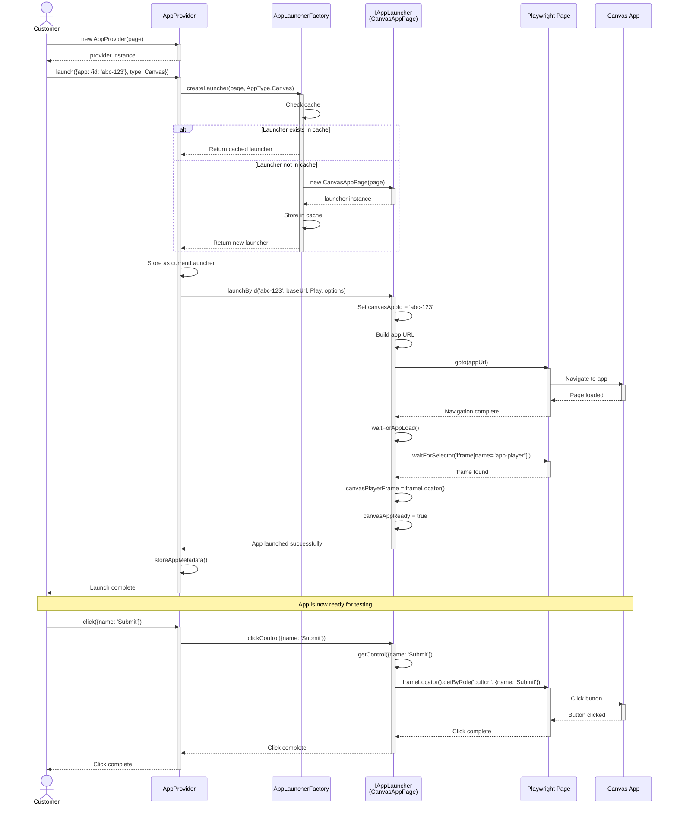
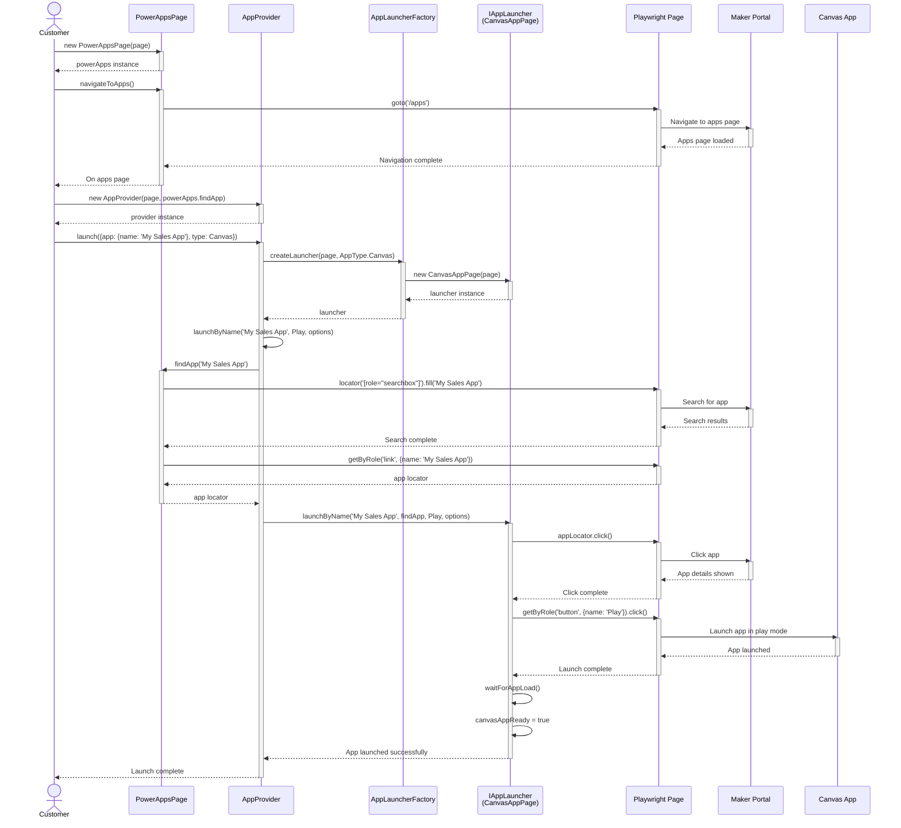
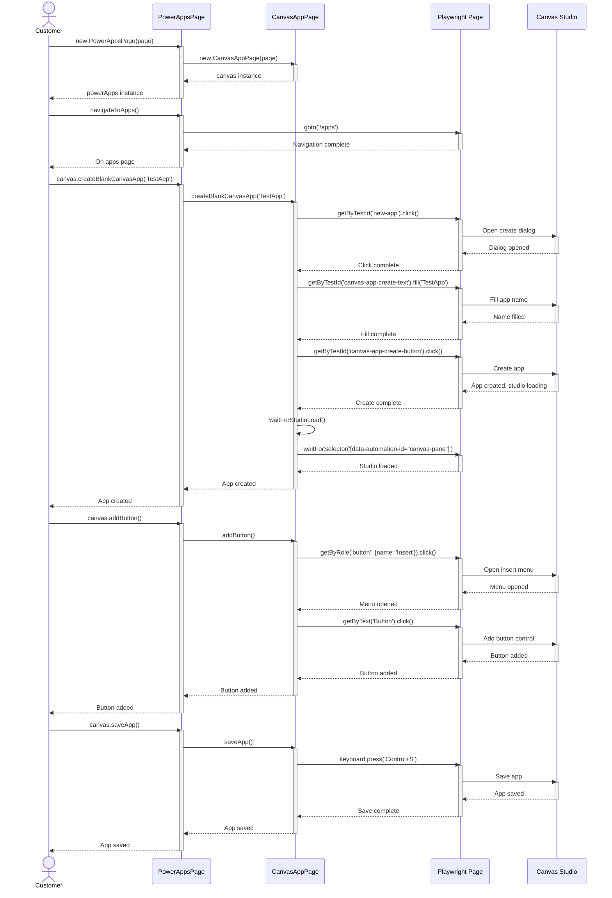

# Sequence Diagrams

This page shows detailed interaction flows between components.

> **Note:** These diagrams illustrate how different components collaborate to accomplish common tasks.

## Sequence 1: Launch App by ID using AppProvider

This is the most common and fastest way to launch and test an app.

### Key Points

- Factory caching improves performance
- App launch happens in iframe for Canvas apps
- All interactions go through the provider for consistency
- State is tracked automatically

## Sequence 2: Launch App by Name using AppProvider

When you don't have the app ID, you can launch by name (requires PowerAppsPage).

### Key Points

- Requires navigation to maker portal first
- Uses search to find app by name
- Slower than launching by ID
- Useful when ID is unknown

## Sequence 3: Create and Test Canvas App using PowerAppsPage

For scenarios where you need to create a new app from scratch.

### Key Points

- PowerAppsPage composes CanvasAppPage
- Studio operations available
- Full app lifecycle management
- Useful for integration tests

## Pattern Comparison

| Pattern             | Complexity | Speed     | Use Case              |
| ------------------- | ---------- | --------- | --------------------- |
| Launch by ID        | Low        | Fast ⚡   | Testing existing apps |
| Launch by Name      | Medium     | Moderate  | When ID unknown       |
| Create and Test     | High       | Slow      | Integration tests     |

## Next Steps

- [Usage Patterns](/architecture/patterns) - Learn when to use each pattern
- [Core Components](/architecture/components) - Understand the class structure
- [Extending the Toolkit](/architecture/extending) - Add new app types
- [Getting Started](/guide/getting-started) - Start writing tests
